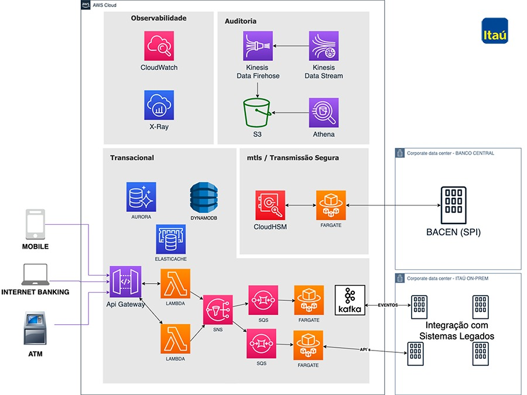

# Análise da Arquitetura do Sistema Pix

## Introdução

Este projeto tem como objetivo analisar a arquitetura do sistema Pix, um sistema de pagamentos instantâneos criado pelo Banco Central do Brasil. O Pix é um exemplo de arquitetura de software moderna que envolve decisões importantes de projeto e utiliza uma infraestrutura altamente escalável e segura na nuvem AWS.

## Integrantes do Grupo

- Gabriel Fernandes
- Gustavo Riegert
- Marcos Paulo
- Samuel Lincoln

## Escolha do Sistema

O sistema escolhido para análise é o Pix, devido à sua relevância e popularidade no mercado de pagamentos instantâneos no Brasil. O Pix processa milhões de transações diárias e possui requisitos rigorosos de disponibilidade, latência e segurança.

## Caracterização do Sistema

O Pix é um sistema de pagamentos instantâneos que permite transferências de dinheiro entre contas bancárias em tempo real, 24 horas por dia, sete dias por semana. Os principais pontos que influenciam nas decisões arquiteturais incluem:

- **Nicho de Mercado:** Pagamentos instantâneos e transferências bancárias.
- **Número de Clientes:** Milhões de usuários em todo o Brasil.
- **Número de Acessos Simultâneos:** Processamento de 20,9 milhões de transações diárias.
- **Requisitos de Segurança:** Alta segurança para prevenir fraudes e garantir a integridade das transações.
- **Requisitos de Desempenho:** Alta disponibilidade (>99,7%) e baixa latência (1,5 segundos por transação em 99% dos casos).

## Detalhamento da Arquitetura do Sistema e Tecnologias

### Requisitos Importantes

- **Disponibilidade:** Manter o serviço operando 24/7 com disponibilidade superior a 99,7%.
- **Latência:** Assegurar que 99% das transações sejam concluídas em até 1,5 segundos.
- **Segurança:** Implementar mecanismos robustos de prevenção de fraudes e garantir a integridade das transações.
- **Escalabilidade:** Planejar uma infraestrutura que possa escalar rapidamente para atender ao aumento no volume de transações.

### Decisões de Projeto

- **Nuvem AWS:** Escolha da AWS como provedor de nuvem devido à sua elasticidade, ferramentas de desenvolvimento e suporte.
- **Serverless e Serviços Gerenciados:** Uso de serviços como AWS Fargate, AWS Lambda, Amazon SNS e Amazon Kinesis para construir uma arquitetura baseada em eventos.
- **Database:** Uso do Amazon DynamoDB para garantir baixa latência e alta disponibilidade.

### Histórico de Mudanças no Projeto

- **Migração do Mainframe:** Transição de uma plataforma mainframe para a nuvem AWS para melhorar a escalabilidade e reduzir custos.
- **Capacitação da Equipe:** Treinamento da equipe interna para utilizar efetivamente as ferramentas e serviços da AWS.

### Tecnologias Utilizadas

- **AWS Fargate:** Serviço serverless para contêineres.
- **AWS Lambda:** Execução de código sem provisionar ou gerenciar servidores.
- **Amazon SNS:** Serviço de mensagens para comunicação entre serviços.
- **Amazon Kinesis:** Processamento de dados em tempo real.
- **Amazon DynamoDB:** Banco de dados NoSQL altamente escalável.

## Arquitetura do Sistema Pix

### Referências

- Livro Engenharia de Software Moderna: [Capítulo 7 - Arquitetura de Software](https://engsoftmoderna.info/cap7.html#introdu%C3%A7%C3%A3o)
- Documentação oficial da AWS
- Artigos e vídeos sobre a implementação do Pix
